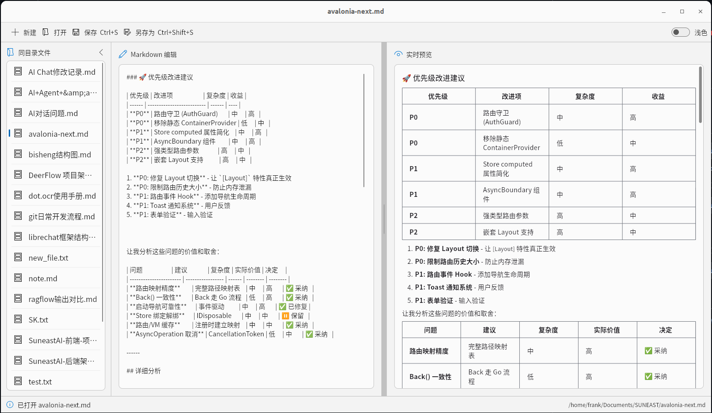
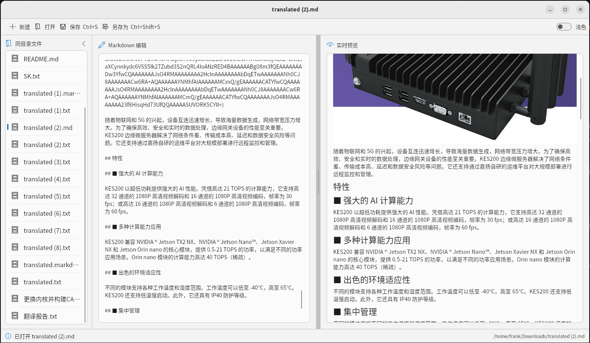
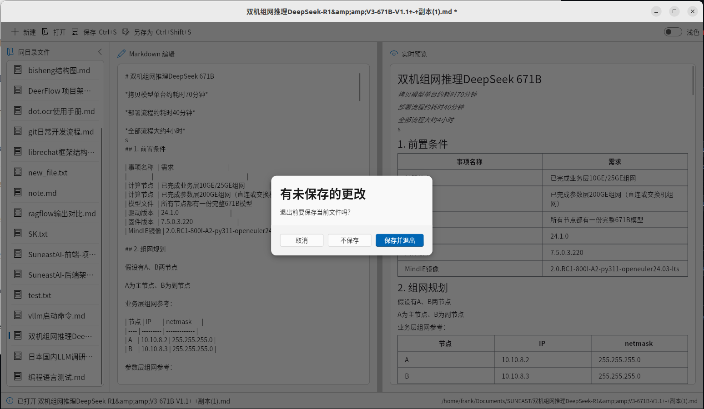
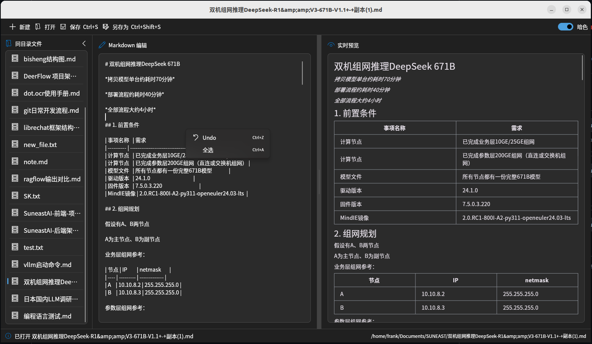

# Markdown 桌面编辑器（Flutter + Fluent UI）

跨平台（桌面优先）的 Markdown 编辑与预览工具，采用 Fluent UI 风格。支持本地文件的打开、编辑、保存/另存为，实时预览和快捷键操作。
## 测试平台
|平台|结果|
|---|---|
|Windows|✅|
|macOS|None|
|Linux|✅|





## 功能

- Fluent UI 桌面界面、明暗主题切换
- Markdown 实时预览（GitHub 风格，表格/列表/链接/图片等）
- 同目录文件侧栏，可折叠与切换
- 拖拽分隔条调节编辑/预览宽度
- 支持 Ctrl+S 保存、Ctrl+Shift+S 另存为
- 打开/切换/退出时检测未保存更改并提示
- 链接外部打开，代码块选中高亮

## 运行

```bash
flutter pub get
flutter run -d linux    # 或 macos/windows
```

## 主要依赖

- `fluent_ui`：桌面 UI 风格
- `flutter_markdown` + `markdown`：Markdown 渲染
- `file_selector`：打开/保存对话框
- `url_launcher`：外部打开链接
- `window_manager`：控制桌面窗口标题/关闭提示
